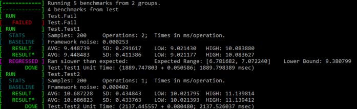

# BenchLib
BenchLib is an easy to use statistically correct micro benchmarking tool to help improve performance in your code.



# Status
OS          | Status
----------- | -------
Linux & OSX | [](https://travis-ci.org/Zefiros-Software/BenchLib)
Windows     | [](https://ci.appveyor.com/project/PaulVisscher/benchlib)

## Features
* Reliable measurements: We measure framework noise, to improve the benchmarking of the actual code.
* Measures the area of interest only: Does not measure startup and finalisation costs.
* Easy to use: The library is completely header only, and does not require extra compile steps nor does it take over
  your classes before you can use it. It works like a google test project.
* Cross platform: Designed to only use c++11, with no external dependencies.
* Regression tests: Catch improvements and decreasing performance of functions early on.
* Profiles memory usage and can detect memory leaks.

## Installation
The whole library is header only, so for usage in your own code you should clone the repository. And add `benchmark/include/` as include path.
After this you can use the include `#include "benchmark/benchLib.h"` in your code to start using the library.

## Usage

### Micro Benchmark
The basic usage would be by using the `MICRO` macro, which is defined as following:

```C++
MICRO( string <benchmark-group>, string <benchmark-name>, size_t <sample-count>, bool <memoryProfiling> )
{
	// code body
}
```

#### Example

```C++
MICRO( Test, Test1, 200, true )
{
    new uint32_t[32];
    new uint32_t[32];
    delete[] new uint32_t[32];
    std::this_thread::sleep_for( std::chrono::milliseconds( 6 ) );
}
```

### Extended Micro Benchmark
Since the simple variant of micro benchmarking measures everything in the code body, we also implemented a version
wherein we can filter out the startup and finalise costs per benchmark:

```C++
EXTMICRO( string <benchmark-group>, string <benchmark-name>, size_t <sample-count>, bool <memoryProfiling>,
{
	// member declarations
	
	Setup()
	{
		// Constructor that can be used for direct initialisation
	}
	
	void Init()
	{
		// Member initialisations
	}
	
	void Baseline()
	{
		// When you want thighter control of your baseline code execution
	}
	
	void Finalise()
	{
		// Member deallocation
	}
	
	void Run()
	{
		// The benchmark body that gets measured
	}
})
```
Note that every function described is optional, and not necessary for benchmarking.

#### Example
```C++
EXTMICRO( Test, Test3, 200, true,
{
    uint32_t *sleep;

    void Init()
    {
        sleep = new uint32_t( 5 );
    }

    void Baseline()
    {

    }

    void Finalise()
    {
        delete sleep;
    }

    void Run()
    {
        std::this_thread::sleep_for( std::chrono::milliseconds( *sleep ) );
    }
} )
```

### Starting Benchmarks
To start the benchmark suite, just include the following in your `main`:

```C++
int main( int argc, char *argv[] )
{
    int32_t result = BenchLib::RunAll( argc, argv );

    return result;
}
```

### Commandline
To enable regressions, we need to store and read old benchmark results. We have the following arguments:

* -in <file>; Specifies the old benchmark regression results.
* -out <file>; Specifies where to store the new benchmark results.
* -v; Describes whether the output file should be html viewer compatible.

## Planned Features
* Variant benchmarks to compare different implementations easily.
* Improved variance estimator by using maximum likelihood estimation.
* Nice html results viewer. (WIP)
* CLI filter options.

## Why BenchLib?
We wanted an easy to use, statistically correct micro benchmarking tool.

## Bugs
When a bug is found please insert it in the issue tracker, so we can resolve it as quickly as we can.

## Contributing
1. Fork it!
2. Create your feature branch: `git checkout -b my-new-feature`
3. Commit your changes: `git commit -am 'Add some feature'`
4. Push to the branch: `git push origin my-new-feature`
5. Submit a pull request

## Authors
* Mick van Duijn <m.vanduijn@zefiros.eu>
* Paul Visscher <p.e.visscher@zefiros.eu>
* Koen Visscher <k.m.visscher@zefiros.eu>

## Used By
We are interested to find out what projects use BenchLib. We would love it to include your projects here, 
just shoot us a mail. :)
 
* [SerLib](https://github.com/Zefiros-Software/SerLib)
* Zefiros Engine

## License
This project is licensed under the MIT license.

```
Copyright (c) 2016 Mick van Duijn, Koen Visscher and Paul Visscher

Permission is hereby granted, free of charge, to any person obtaining a copy
of this software and associated documentation files (the "Software"), to deal
in the Software without restriction, including without limitation the rights
to use, copy, modify, merge, publish, distribute, sublicense, and/or sell
copies of the Software, and to permit persons to whom the Software is
furnished to do so, subject to the following conditions:

The above copyright notice and this permission notice shall be included in
all copies or substantial portions of the Software.

THE SOFTWARE IS PROVIDED "AS IS", WITHOUT WARRANTY OF ANY KIND, EXPRESS OR
IMPLIED, INCLUDING BUT NOT LIMITED TO THE WARRANTIES OF MERCHANTABILITY,
FITNESS FOR A PARTICULAR PURPOSE AND NONINFRINGEMENT. IN NO EVENT SHALL THE
AUTHORS OR COPYRIGHT HOLDERS BE LIABLE FOR ANY CLAIM, DAMAGES OR OTHER
LIABILITY, WHETHER IN AN ACTION OF CONTRACT, TORT OR OTHERWISE, ARISING FROM,
OUT OF OR IN CONNECTION WITH THE SOFTWARE OR THE USE OR OTHER DEALINGS IN
THE SOFTWARE.
```